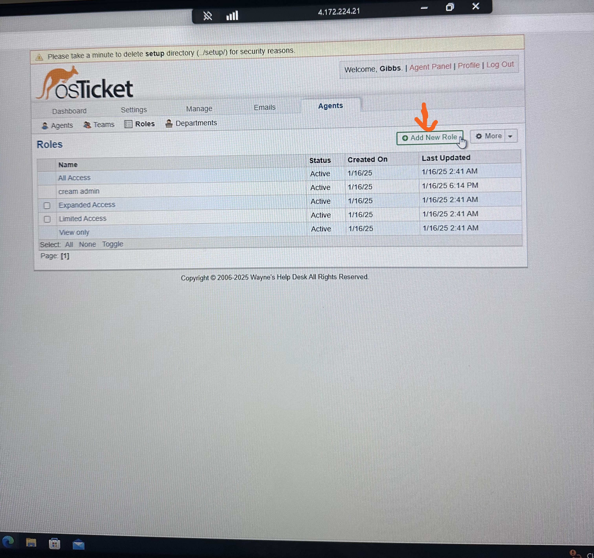
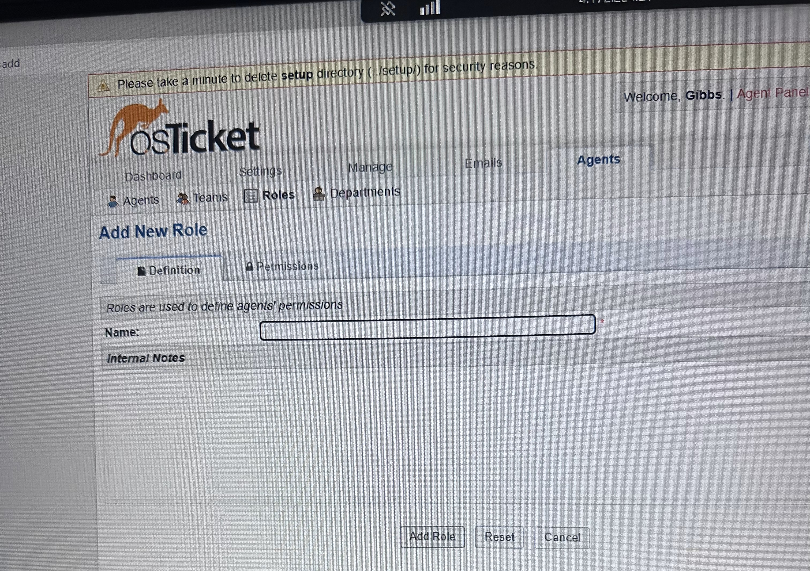

<h1>osTicket - Post-Install Configuration</h1>
In this tutorial, I will walk through the post-installation configuration of osTicket, an open-source help desk ticketing system designed to optimize customer support processes. Also I will demonstrate how to create users, agents, and more.
 

<h2>Environments and Technologies Used</h2>

- Microsoft Azure (Virtual Machines/Compute)
- Remote Desktop
- Internet Information Services (IIS)

<h2>Operating Systems Used </h2>

- Windows 10</b> (22H2)  

<h2>Configuration Steps</h2>

<h4>Log-in</h4>

  

Before starting the configuration process, locate the link (highlighted in red) that directs you to the Admin or Control Panel. Use this link to log in with the Admin account created in the Admin User section. And to access the end user accounts, use the link on the left (highlighted in blue).

 

<h4>Configuring</h4>

We're going to kick this off by configuring Roles. A role is a permission that grants agents access.To configure roles, navigate to the Admin Panel → Agents → Roles, where you can manage agents available access. Next, we move on to Departments. A department helps determine ticket visibility. For example, if someone in the Accounting department has a computer issue and needs tech support, they can simply refer to the Accounting Department when creating a ticket. This makes it easier for the agent to identify and handle the issue promptly. In the Departments section of the Admin Panel, tickets can be assigned to different departments. You can find this option by going to Admin Panel → Agents → Departments. Teams are used to group individuals from different departments, allowing them to collaborate on tasks. Within a team, members can have varying roles and permissions. To configure Teams, navigate to Admin Panel → Agents → Teams. Next, we’ll configure a setting that allows users to create tickets without requiring them to log in. This can be done by going to Admin Panel → Settings → User Settings and unchecking the option for Registration Required. Finally, we’ll create an account for agents (workers). To do this, go to Admin Panel → Agents → Add New. An SLA(Service Level Agreement) is the amount of time an agent has to resolve or respond to a ticket. To configure SLA, go to Admin Panel → Manage → SLA → Add New SLA. The final thing to configure is a Help Topic, which is the category selected by the user submitting the ticket or the agent resolving the issue. To confiure this we go to Admin Panel → Manage → Help Topics → Add new Help Topics.

 

<h3>Example how to create a Help Topic:</h3>

To create a Help Topic: Admin Panel → Manage → Help Topics → Add new Help Topics

Once reached the "Add New Help Topic" page, fill out all the required fields. For this exmaple I'll use the following:

Topic: Computer Issue

Status: Active

Type: Public

Parent Topic: Report a Problem

Then click 'Add Topic' and it will be successfully added.

Follow the same steps to create 3-4 topics to use it for a practice in the Ticket Lifecycle. https://github.com/united16/ticket-lifecycle

<h3>Example how to create a user:</h3>

To create a user/customer, I'll login as an Admin and navigate to Admin Panel → Users → Add new

Once getting to the page, fill out all the required fields. For this exmaple I'll use the following: 

Email-Address: oror@hotmail.com

Full Name: Wayne Roro

Then click 'Add User' and it will successfully create

<h3>Example how to create an Agent:</h3>

To create an Agent, I'll login as an Admin and navigate to Admin Panel → Agents → Add New Agent

Once getting to the page, fill out all the required fields. For this exmaple I'll use the following: 

Email-Address: jt16@yahoo.com

Full Name: Jack Tommy

Username: jt16 (click 'Set Password' to the right of username and uncheck the option to send a password reset email)+

Assign the agent a department and role

Then click 'Create' and it will successfully create the Agent

<!-- <h2>Creating Role, Department, Teams and Users</h2>

<h4>Roles<h4/> 
  
  

Enter login information and click the 'Login' button

   

Admin Panel 

  Then click 'Admin Panel'(circled in blue)

   

Agents  

 Next, hover the cursor over 'Agents' and click on 'Roles'

   

Roles 

 Once on the Roles page, click 'Add New Role'

   

Naming

 Give the new role a name

   

Permission

After naming the role, go to the 'Permissions' section (to the right of 'Definition') and assign either full access or minimum access, depending on the level of access you want to grant.Then, click the 'Add Role' button at the bottom to create the role.

   

Success

Role has been created and will appear at the top of the list. You can click on it to modify the permissions or change the name

    

<h3>Department</h3>  

Admin Panel

 Click on 'Admin Panel'(circled in blue)

   

Agents

Hover the cursor over "Agents," then click on Department.

   

Before beginning the configuration process,locate the link(highlited in red) to direct you to the Admin or Control pannel to log in with the Admin account that was created in the Admin User section.
 

   

-->
